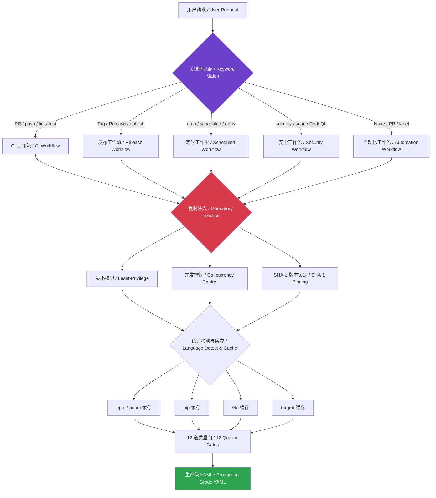

# 🤖 GitHub Actions 工作流 Skill · Workflow Skill

<div align="center">

[](https://github.com/2B0748/github-actions-skill/stargazers)
[](LICENSE)
[](https://github.com/2B0748/github-actions-skill/commits/main)
[](PROMPT.md)

> 🤖 AI 驱动的 GitHub Actions 工作流生成、审查与优化 —— 5 套模板 · 3 项强制配置 · 12 道质量门 · 6 语言缓存策略 · 全平台通用
>
> 🤖 AI-powered GitHub Actions workflow generation, review & optimization — 5 Templates · 3 Mandatory Configs · 12 Quality Gates · 6 Cache Strategies · Universal for all AI agents

</div>

---

## 🧭 决策引擎 / Decision Engine



## 🌐 平台支持 / Platform Support

<table>
<tr>
<td align="center" width="25%"><b>🔮 Claude Code</b></td>
<td align="center" width="25%"><b>🖱️ Cursor</b></td>
<td align="center" width="25%"><b>🤖 GitHub Copilot</b></td>
<td align="center" width="25%"><b>🌊 Windsurf / Aider / Cline</b></td>
</tr>
<tr>
<td>

```bash
cp SKILL.md \
  .claude/skills/
  github-actions.md
```

</td>
<td>

```bash
cp PROMPT.md \
  .cursor/rules/
  github-actions.md
```

</td>
<td>

```bash
cp PROMPT.md \
  .github/copilot-
  instructions.md
```

</td>
<td>

使用 `PROMPT.md` 或
`PROMPT.cn.md` 粘贴到
System Prompt /
Custom Instructions

</td>
</tr>
</table>

## ✨ 核心能力 / Core Capabilities

| 能力 Capability | 说明 Description |
|----------------|------------------|
| 🔧 **CI 生成 / CI Generation** | 全流程 Lint → Test → Build，自动检测语言生态 / Auto-detect language ecosystem |
| 📦 **自动发布 / Auto Release** | Tag 触发自动构建、打包并创建 Release / Tag-triggered build, package & release |
| 🛡️ **安全审查 / Security Audit** | 最小权限声明、SHA-1 锁定、密钥泄漏扫描 / Least-privilege, SHA-1 pinning, secret scan |
| ⚡ **性能优化 / Perf Optimization** | 缓存策略匹配、Job 并行拆分、Runner 选择建议 / Cache matching, job parallelization, runner advice |
| 🔒 **强制配置 / Mandatory Config** | permissions · concurrency · SHA 锁定，三项缺一不可 / 3 mandatory configs — none can be omitted |
| 🌍 **多语言覆盖 / Multi-language** | Node.js · Python · Go · Rust · Docker，缓存策略全覆盖 / 6 cache strategies fully covered |

## 📁 文件清单 / Files

| 文件 File | 语言 Language | 说明 Description |
|-----------|:------------:|------------------|
| [`SKILL.md`](SKILL.md) | 🇬🇧 EN | Claude Code 格式（含 YAML 元数据） / Claude Code format (with YAML metadata) |
| [`SKILL.cn.md`](SKILL.cn.md) | 🇨🇳 中文 | Claude Code 格式（含 YAML 元数据） / Claude Code format (with YAML metadata) |
| [`PROMPT.md`](PROMPT.md) | 🇬🇧 EN | 通用版 / Universal edition (Cursor / Copilot / Windsurf 等) |
| [`PROMPT.cn.md`](PROMPT.cn.md) | 🇨🇳 中文 | 通用版 / Universal edition (Cursor / Copilot / Windsurf 等) |
| [`examples/`](examples/) | ⚙️ YAML | 5 个真实语言/场景的生成示例 / 5 real-world generation examples |
| [`CONTRIBUTING.md`](CONTRIBUTING.md) | 🇬🇧 EN | 贡献指南 / Contributing guide |

## 🐶 自己吃自己的狗粮 / Dogfooding

> 本仓库的 CI 由此 Skill 亲自生成 —— 自己吃自己的狗粮 🦴
>
> This repo's CI is generated by this very Skill — eating our own dog food 🦴

[`.github/workflows/ci.yml`](.github/workflows/ci.yml) 是本 Skill 的直接产物：最小权限、并发控制、SHA-1 锁定、缓存优化 —— 无一遗漏。

[`.github/workflows/ci.yml`](.github/workflows/ci.yml) is a direct output of this Skill: least privilege, concurrency control, SHA-1 pinning, cache optimization — nothing missed.

## 🧪 生成示例 / Generated Examples

| 示例 Example | 语言 Language | 场景 Scenario |
|-------------|:-----------:|---------------|
| [`nodejs-ci.yml`](examples/nodejs-ci.yml) | Node.js | ESLint + Jest，npm 缓存，SHA 锁定 / npm cache, SHA-pinned |
| [`python-ci.yml`](examples/python-ci.yml) | Python | Ruff + Pytest，pip 缓存，多版本矩阵 / pip cache, multi-version matrix |
| [`go-ci.yml`](examples/go-ci.yml) | Go | golangci-lint + go test -race，Go 缓存 / Go cache |
| [`release.yml`](examples/release.yml) | 通用 | Tag 触发自动发布 / Tag-triggered release |
| [`multi-lang-matrix.yml`](examples/multi-lang-matrix.yml) | Rust + Node.js | Monorepo 前后端并行 CI / Monorepo frontend + backend parallel CI |

## 📜 许可 / License

**MIT** — 欢迎 Fork、修改和分享 / Feel free to fork, modify, and share.
