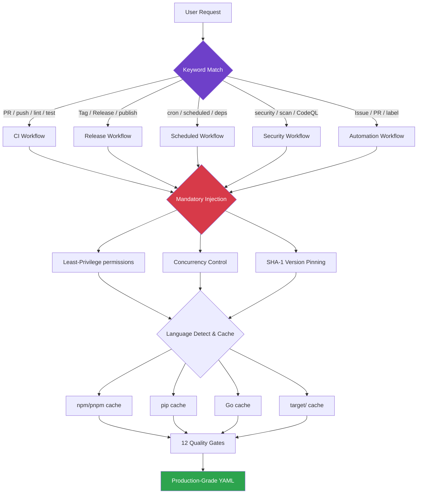

# GitHub Actions Workflow Skill

<div align="center">

[](https://github.com/2B0748/github-actions-skill/stargazers)
[](LICENSE)
[](https://github.com/2B0748/github-actions-skill/commits/main)
[](PROMPT.md)

> 🤖 AI 驱动的 GitHub Actions 工作流生成、审查与优化 —— 全平台通用
>
> 🤖 AI-powered GitHub Actions workflow generation, review & optimization — universal for all AI agents

</div>

---

## Decision Engine



## Universal Platform Support

<table>
<tr>
<td align="center"><b>Claude Code</b></td>
<td align="center"><b>Cursor</b></td>
<td align="center"><b>GitHub Copilot</b></td>
<td align="center"><b>Windsurf / Aider / Cline</b></td>
</tr>
<tr>
<td>

```bash
cp SKILL.md \
  .claude/skills/
  github-actions.md
```

</td>
<td>

```bash
cp PROMPT.md \
  .cursor/rules/
  github-actions.md
```

</td>
<td>

```bash
cp PROMPT.md \
  .github/copilot-
  instructions.md
```

</td>
<td>

Use `PROMPT.en.md` for English<br>
or paste `PROMPT.md` into
System Prompt or
Custom Instructions

</td>
</tr>
</table>

## Capabilities

| Capability | Description |
|------------|-------------|
| **CI Generation** | Full Lint -> Test -> Build pipeline with automatic language ecosystem detection |
| **Auto Release** | Tag-triggered auto build, packaging, and Release generation |
| **Security Review** | Least-privilege permissions, SHA-1 pinning, secret leak scanning |
| **Performance Optimization** | Cache strategy matching, parallel job splitting, runner selection advice |
| **Mandatory Enforcement** | 3 mandatory configs (permissions / concurrency / version pinning) + 12 quality gates |
| **Multi-language** | Node.js / Python / Go / Rust / Docker cache strategies fully covered |

## Files

| File | Language | Description |
|------|----------|-------------|
| [`SKILL.md`](SKILL.md) | English | Claude Code format (with YAML metadata) |
| [`SKILL.cn.md`](SKILL.cn.md) | 中文 | Claude Code 格式（含 YAML 元数据） |
| [`PROMPT.md`](PROMPT.md) | English | Universal edition (Cursor / Copilot / Windsurf, etc.) |
| [`PROMPT.cn.md`](PROMPT.cn.md) | 中文 | 通用版（Cursor / Copilot / Windsurf 等） |
| [`PROMPT.en.md`](PROMPT.en.md) | English | Universal (Cursor / Copilot / Windsurf / all agents) |
| [`examples/`](examples/) | YAML | 5 real-world language/scenario generation examples |
| [`CONTRIBUTING.md`](CONTRIBUTING.md) | English | Contributing guide |

## Dogfooding

> This repo eats its own dog food — our own CI below was generated by this Skill

[`.github/workflows/ci.yml`](.github/workflows/ci.yml) is a direct output of this Skill: least privilege, concurrency control, SHA-1 pinning, cache optimization — nothing missed.

## License

MIT
