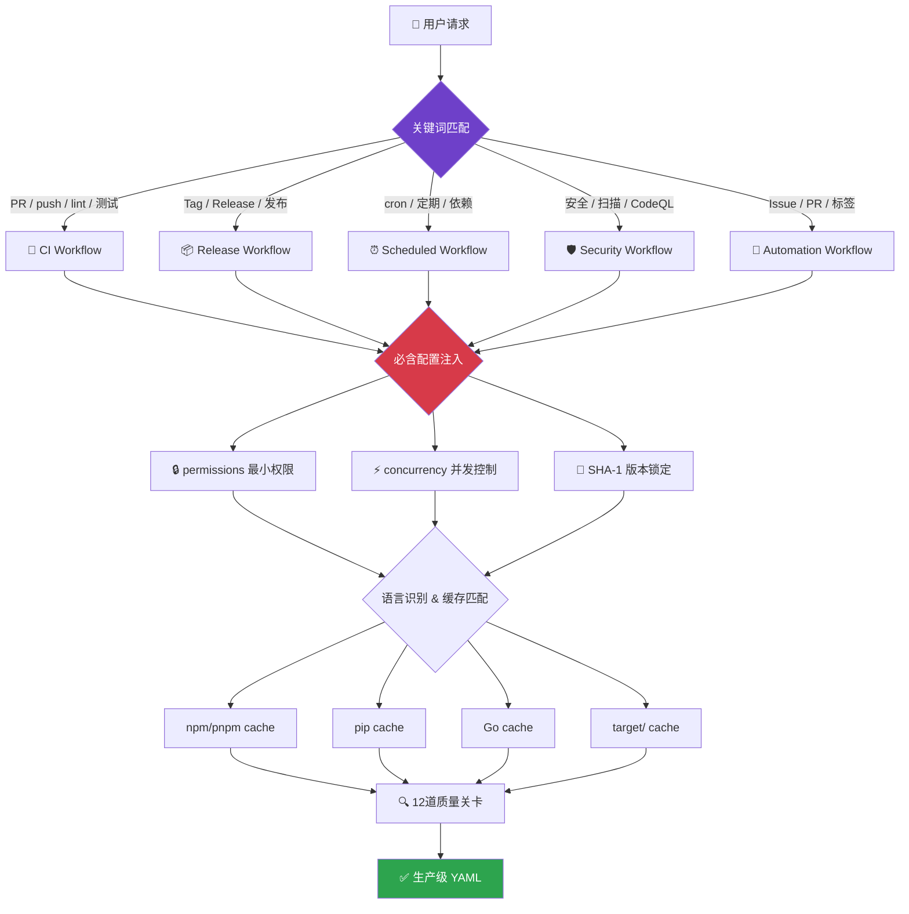

# GitHub Actions Workflow Skill

<div align="center">

[](https://github.com/2B0748/github-actions-skill/stargazers)
[](LICENSE)
[](https://github.com/2B0748/github-actions-skill/commits/main)
[](PROMPT.md)

> 🤖 AI 驱动的 GitHub Actions 工作流生成、审查与优化 —— 全平台通用
>
> 🤖 AI-powered GitHub Actions workflow generation, review & optimization — universal for all AI agents

</div>

---

## 决策引擎 / Decision Engine



## 全平台支持 / Universal

<table>
<tr>
<td align="center"><b>Claude Code</b></td>
<td align="center"><b>Cursor</b></td>
<td align="center"><b>GitHub Copilot</b></td>
<td align="center"><b>Windsurf / Aider / Cline</b></td>
</tr>
<tr>
<td>

```bash
cp SKILL.md \
  .claude/skills/
  github-actions.md
```

</td>
<td>

```bash
cp PROMPT.md \
  .cursor/rules/
  github-actions.md
```

</td>
<td>

```bash
cp PROMPT.md \
  .github/copilot-
  instructions.md
```

</td>
<td>

For English: use `PROMPT.en.md`<br>
中文：粘贴 `PROMPT.md` 到
System Prompt 或
自定义指令

</td>
</tr>
</table>

## 能力矩阵 / Capabilities

| 能力 | 说明 |
|------|------|
| 🔧 **CI 生成** | Lint → Test → Build 完整流水线，自动检测语言生态 |
| 📦 **自动发布** | Tag 触发自动构建、打包、生成 Release |
| 🛡️ **安全审查** | permissions 最小化、SHA-1 锁定、密钥泄露扫描 |
| ⚡ **性能优化** | 缓存策略匹配、并行 Job 拆分、Runner 选型建议 |
| 📋 **强制执行** | 3 项必含配置（permissions / concurrency / 版本锁定）12 道质量关卡 |
| 🌐 **多语言** | Node.js / Python / Go / Rust / Docker 缓存策略全覆盖 |

## 文件结构 / Files

| 文件 | 语言 | 说明 |
|------|------|------|
| [`SKILL.md`](SKILL.md) | 🇨🇳 中文 | Claude Code 格式（含 YAML 元数据） |
| [`PROMPT.md`](PROMPT.md) | 🇨🇳 中文 | 通用版（Cursor / Copilot / Windsurf 等） |
| [`PROMPT.en.md`](PROMPT.en.md) | 🇺🇸 English | Universal (Cursor / Copilot / Windsurf / all agents) |
| [`examples/`](examples/) | 🌐 YAML | 5 个真实语言/场景生成示例 |
| [`CONTRIBUTING.md`](CONTRIBUTING.md) | 🇨🇳 中文 | 贡献指南 |

## 自举 Dogfooding

> 本仓库自己吃自己的狗粮 —— 用本 Skill 生成了自己的 CI 👇

[`.github/workflows/ci.yml`](.github/workflows/ci.yml) 正是本 Skill 的输出物：最小权限、并发控制、SHA-1 锁定、缓存优化，一条不落。

## 📢 推广文章 / Articles

| 平台 | 链接 | 状态 |
|------|------|------|
| Dev.to | [I Built an AI Skill That Writes GitHub Actions...](https://dev.to/2b0748/i-built-an-ai-skill-that-writes-github-actions-workflows-with-zero-config-errors-2mh1) | ✅ 已发布 |
| 掘金 | 待发布 → 填入链接 | 🔗 |
| V2EX | 待发布 → 填入链接 | 🔗 |

---

## 许可 / License

MIT
